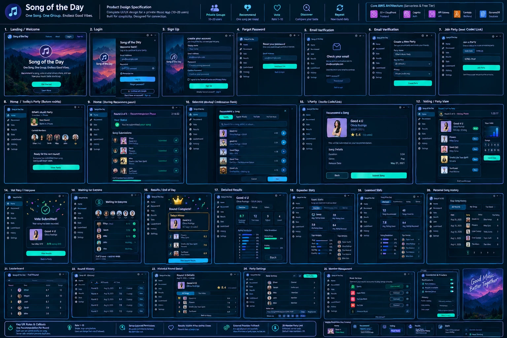

# Design reference

`mockup-v2-overview.webp` is the **approved second mockup direction** (spec §20), added by Ethan on 2026-10-01.
It's the primary **visual** reference: layout, colour, typography, components, and screen inventory.

**Precedence:** for *behaviour* (what's allowed, when things unlock, what's visible), follow
`docs/PRODUCT_DECISIONS.md` and ADR-0004. The mockup was drawn before the weekly model was decided, so some
screens show an older flow. The adaptations below say how to build those screens. When the mockup and the
decisions disagree, keep the mockup's look and follow the decisions' rules.

## Visual language (to be turned into tokens in P7.1)

Final tokens, sampled from the image in P7.1 and defined in `apps/web/src/index.css` (`@theme`). Use them as
Tailwind classes (`bg-surface`, `text-primary`, `border-line`, …). Contrast check of every text/background pair
happens in P8.12.

| Token | Value | Token | Value |
|---|---|---|---|
| `bg` | `#011420` | `primary` (teal) | `#00E7D0` |
| `surface` | `#01192B` | `primary-ink` (text on teal) | `#01231F` |
| `surface-raised` | `#022238` | `blue` | `#1AA4FE` |
| `active` (nav) | `#013A62` | `purple` | `#8B5CF6` |
| `line` (borders) | `#0D3352` | `gold` | `#F5C542` |
| `glow` | `#1AA4FE` | `success` | `#22C55E` |
| `ink` (text) | `#E6F1FF` | `muted` (text) | `#8BA3BF` |

Descriptions of the original look, kept for reference:

| Token | Looks like | Used for |
|---|---|---|
| `bg` | Very dark navy, near black | Page background |
| `surface` | Dark navy, slightly lighter than `bg` | Cards, panels, sidebar |
| `border-glow` | Thin neon-blue / cyan outline | Card and panel borders (subtle glow) |
| `primary` | Bright teal / cyan | Main buttons (Get Started, Log in, Join Party, Submit Song, View Results) |
| `accent-blue` | Neon blue | Active nav item, links, tabs, progress bars, play buttons |
| `accent-purple` | Purple / violet | Logo gradient, highlights, decorative gradients |
| `gold` | Warm gold / yellow | Winner crown, star ratings, "Today's Winner" card border |
| `success` | Green | "Submitted" / done checkmarks |
| `text` / `text-muted` | White / blue-grey | Body text / secondary text |

- **Shape:** rounded cards (about 12–16 px radius), pill-shaped buttons and tabs, circular avatars, square album
  art with small rounded corners.
- **Type:** clean sans-serif; large bold headings ("Song of the Day", "Round Complete!"); big numerals for stats
  (8.7, 12, 9, 4).
- **Imagery:** album art everywhere a song appears. Hero and auth screens use a purple-to-blue mountain-night
  illustration with the music-note logo in a gradient circle.
- **Charts:** horizontal bar distributions (rating 1–10), simple donut/split bars (anonymous vs public), rank lists.

## Layout

- **Desktop/tablet:** left sidebar nav (logo at top, then Home, Recommend, Vote, Results, Stats, Leaderboard,
  History, Settings), with the main content in cards to the right.
- **Mobile:** bottom tab bar with Home, Recommend, Voting, Results, Stats (see the "Mobile Responsive (Key
  Screens)" strip, bottom-right of the mockup). Single-column cards. Settings and History are reached from Home
  or the profile menu.
- **Auth screens** (Landing, Login, Sign Up, Forgot Password, Email Verification): illustration panel and form
  side by side on desktop; illustration becomes a header on mobile.

## Screen map: mockup → roadmap → adaptation

| Mockup # | Mockup screen | Roadmap | Adaptation for the weekly model |
|---|---|---|---|
| 1 | Landing / Welcome | P8.1 | Change "Recommend a song, vote on what others share" copy to describe the weekly flow. |
| 2–5 | Login, Sign Up, Forgot Password, Email Verification | P7.3 | **Hide "Continue with Google"** in v1 (email + password only; see "Open questions"). Sign Up's Terms checkbox becomes a short "By signing up you agree to the privacy note" link. |
| 6 | Create a New Party | P8.3 | Fields: party name, max members (default 20), timezone (detected). Drop "Privacy: Private (invite only)", since every party is private. |
| 7, 11 | Join Party (code / link) | P8.2 | As drawn. |
| 8 | Home / Today's Party (before round) | P8.3 | Becomes **Home / Today**: "Share today's song" call to action, members with today's ✓ status, countdown to Sunday 11:59 pm. "Next round starts in 3 hours" → shows on weekends as "New week starts Monday". |
| 9 | Home (during recommendation) | P8.3 | "Round 3 of 5 · Recommendation Phase" → **"Wednesday · Day 3 of 5"**. "Song Submissions" list = today's songs, anonymous (D10). Show **"3 of 5 shared today"** (a count). Per-person ✓ marks only when the party reveals recommenders, because names next to a song list would reveal whose song is whose. |
| 10 | Recommend a Song (search) | P8.4 | Provider tabs (Spotify / Apple Music / YouTube / YouTube Music) only for providers ADR-0007 actually supports; v1 is likely one search tab plus paste-a-link. |
| 11 (second panel) | Confirm recommendation | P8.4 | Title "Share today's song". Remove the song's star rating (it hasn't been rated yet). Add "You can't change it after sharing." |
| 12 | Voting / Party View | P8.5 | "Round 3 of 5 · Voting Phase" → **"This week's songs"**, grouped by day with an Unrated filter. The 1–10 grid RatingControl stays as drawn. Hide recommender names (D10). |
| 14 | Vote Submitted | P8.5 | Becomes a lightweight "Rating saved ✓ · you can change it until Sunday 11:59 pm" confirmation (toast or inline). "View Results" → "Results unlock Sunday night". |
| 15 | Waiting for Everyone | P8.3 / P8.5 | **Must not show other people's scores** (the mockup shows "8/10, 7/10"). That breaks D9. Show progress only: how many have shared today (names only if recommenders are revealed), and your own "12 of 31 rated". |
| 16 | Results / End of Day ("Round Complete!", Today's Winner) | P8.6 | Becomes **Weekly Results** ("Week Complete!"): the crown card shows each day's **Bop of the Day** winner, then the full weekly ranking. |
| 17 | Detailed Results (Overview / Ratings / Voters tabs) | P8.6 | As drawn. The "Voters" tab and per-person "Vote Breakdown" only appear if `showWhoRatedWhat` is on (D11); otherwise show anonymous counts. |
| 18 | Expanded (personal) stats | P8.8 | As drawn. Each figure shows "Based on N" or "Not enough data yet". |
| 19 | Leaderboard stats (group) | P8.9 | As drawn, with definitions in tooltips. |
| 20 | Personal Song History | P8.7 / P8.8 | As drawn (date, song, artist, your rating). |
| 21 | Leaderboard (Overall / Recommendations / Voting / Genres) | P8.9 | Hide the Genres tab unless the provider supplies genres. Show sample size on every row. |
| 22 | Round History | P8.7 | Rounds → **weeks** ("Week of Oct 5"), with song count and top song. |
| 23 | Historical Round Detail | P8.7 | Weekly results for a past week (same component as 16/17). |
| 24 | Party Settings | P8.10 | Members list, invite link with Copy / Regenerate, timezone, visibility settings, pause/resume. |
| 25 | Member Management | P8.10 | As drawn (host only: remove member). |
| — | Connected Providers & Privacy panel | P8.11 | v1 has **no account connections** (D20). Replace "Connect" buttons with a **Preferred music app** picker (D22). Drop Notifications toggles (out of scope v1). "Vote visibility / Profile visibility" are party settings (D10/D11), not per-user. |
| — | Mobile Responsive strip | P8.12 | Bottom tab bar layout; check every screen at 320–430 px. |
| — | Key UX Rules & Callouts strip | — | Mostly matches. "One recommendation per round" → one per day; "Results visible after voting closes" → after the week ends. |

## Open questions (defaults in use until Ethan says otherwise)

- **Google sign-in** (mockup shows "Continue with Google"). Default: **not in v1.** Adding it means registering a
  Google OAuth app and configuring Cognito federation. It's free, but it's extra setup and a [HUMAN] task. Can be added later.
